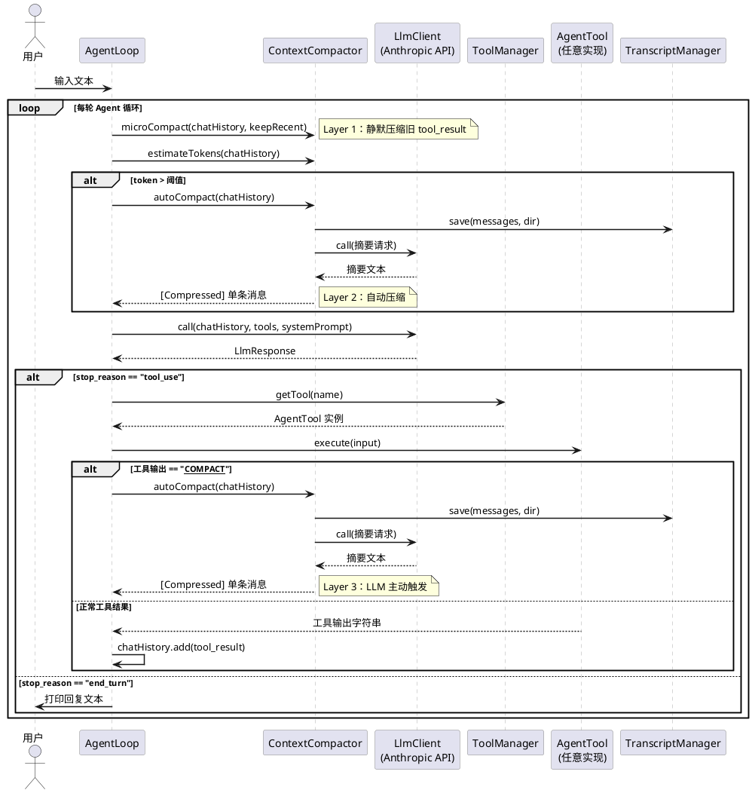

# agent_demo — 项目说明文档

> Java 17 / Maven 纯 Java 项目，无 Spring 框架。  
> 实现了一个可与 Anthropic Claude API 交互的本地 Agent，支持工具调用、子 Agent 派发、待办管理、Skill 按需加载，以及三层上下文压缩（s06）。

---

## 一、快速启动

### 前置条件

- JDK 17+
- Maven 3.8+
- Anthropic API Key（或兼容中转地址）

### 配置

在项目根目录创建 `.env` 文件：

```env
ANTHROPIC_API_KEY=sk-ant-xxxxxxxx
ANTHROPIC_BASE_URL=https://api.anthropic.com/v1   # 使用中转时替换此地址
MODEL_ID=claude-3-5-sonnet-20240620

# 子 Agent 最大迭代轮次
SUBAGENT_MAX_ITERATIONS=30

# s06 上下文压缩参数
COMPACT_TOKEN_THRESHOLD=50000   # 触发 Layer 2 的 token 估算阈值
COMPACT_KEEP_RECENT=3           # Layer 1 保留最近几条工具结果
TRANSCRIPT_DIR=.transcripts     # 历史落盘目录
```

### 编译与运行

```bash
mvn compile exec:java -Dexec.mainClass="cn.edu.agent.AgentApplication"
```

### 运行测试

```bash
mvn test
```

---

## 二、项目结构

```
agent_demo/
├── pom.xml
├── .env                          # 本地配置（不提交 git）
├── .transcripts/                 # 运行时自动创建，存放历史落盘 JSONL
├── skills/                       # Skill 知识文档目录（每个子目录放一个 SKILL.md）
└── src/
    ├── main/java/cn/edu/agent/
    │   ├── AgentApplication.java         程序入口
    │   ├── config/
    │   │   └── AppConfig.java            全局配置读取
    │   ├── core/
    │   │   ├── AgentLoop.java            主 Agent 循环
    │   │   ├── LlmClient.java            HTTP 调用 Claude API
    │   │   ├── SubAgentRunner.java       子 Agent 接口
    │   │   └── DefaultSubAgentRunner.java 子 Agent 实现
    │   ├── compact/
    │   │   ├── ContextCompactor.java     三层压缩核心
    │   │   └── TranscriptManager.java    历史落盘
    │   ├── tool/
    │   │   ├── AgentTool.java            工具接口
    │   │   ├── AgentRole.java            角色枚举（PARENT/CHILD）
    │   │   ├── ToolRegistry.java         工具注册表
    │   │   ├── ToolManager.java          工具管理 + todo 问责
    │   │   ├── utils/
    │   │   │   └── WorkspaceEnv.java     路径安全沙箱
    │   │   └── impl/
    │   │       ├── BashTool.java         执行 cmd 命令
    │   │       ├── ReadFileTool.java     读取文件
    │   │       ├── WriteFileTool.java    写入文件
    │   │       ├── EditFileTool.java     字符串替换编辑文件
    │   │       ├── TodoTool.java         待办列表管理
    │   │       ├── LoadSkillTool.java    按需加载 Skill
    │   │       ├── TaskTool.java         派发子任务（父 Agent 专属）
    │   │       └── CompactTool.java      主动触发压缩（s06）
    │   ├── pojo/
    │   │   ├── AgentContext.java         子 Agent 上下文
    │   │   ├── ContentBlock.java         LLM 响应内容块
    │   │   ├── LlmResponse.java          LLM 完整响应
    │   │   ├── SubAgentResult.java       子 Agent 执行结果
    │   │   └── TodoItem.java             待办条目
    │   ├── todo/
    │   │   └── TodoManager.java          待办 CRUD 管理器
    │   └── skill/
    │       ├── SkillLoader.java          扫描并加载 Skill 文档
    │       ├── SkillEntry.java           单个 Skill（元数据 + 正文）
    │       └── SkillMeta.java            Skill frontmatter 数据类
    └── test/java/cn/edu/agent/test/
        └── ContextCompactorTest.java     三层压缩单元测试
```

---

## 三、模块功能说明

### 3.1 入口 — `AgentApplication`

程序启动点，负责组装所有组件：

1. 初始化 `SkillLoader`，扫描 `skills/` 目录
2. 构建 `ToolRegistry`，注册所有工具
3. 创建 `DefaultSubAgentRunner`，注入 `LlmClient` 和 `ToolRegistry`
4. 将 `TaskTool`（父 Agent 专属）注册到 `ToolRegistry`
5. 启动 `AgentLoop`，进入交互循环

---

### 3.2 配置 — `AppConfig`

从 `.env` 文件或系统环境变量读取配置，**系统环境变量优先级高于 `.env`**。

| 方法 | 对应配置键 | 默认值 |
|------|-----------|--------|
| `getApiKey()` | `ANTHROPIC_API_KEY` | — |
| `getBaseUrl()` | `ANTHROPIC_BASE_URL` | `https://api.anthropic.com/v1` |
| `getModelId()` | `MODEL_ID` | `claude-3-5-sonnet-20240620` |
| `getSubagentMaxIterations()` | `SUBAGENT_MAX_ITERATIONS` | `30` |
| `getCompactTokenThreshold()` | `COMPACT_TOKEN_THRESHOLD` | `50000` |
| `getCompactKeepRecent()` | `COMPACT_KEEP_RECENT` | `3` |
| `getTranscriptDir()` | `TRANSCRIPT_DIR` | `.transcripts` |

---

### 3.3 主循环 — `AgentLoop`

Agent 的核心驱动，每次用户输入后进入 `runAgentCycle()` 循环，直到 LLM 返回 `end_turn`：

```
用户输入
  └─► chatHistory.add(user 消息)
        └─► runAgentCycle()
              ├─ [Layer 1] microCompact          ← 每轮必执行
              ├─ [Layer 2] autoCompactIfNeeded   ← token 超阈值时触发
              ├─ llmClient.call()
              ├─ 若 stop_reason == "tool_use"
              │    ├─ 执行各工具
              │    └─ 若工具输出 == "__COMPACT__" → [Layer 3] forceCompact
              └─ 若 stop_reason == "end_turn" → 打印回复，结束本轮
```

---

### 3.4 API 客户端 — `LlmClient`

封装对 Anthropic Messages API 的 HTTP 调用（OkHttp3）：

- 支持官方直连（`Authorization: Bearer`）和中转模式（`x-api-key`）
- 超时：连接 60s，读取 60s
- 响应反序列化为 `LlmResponse`

---

### 3.5 子 Agent — `SubAgentRunner` / `DefaultSubAgentRunner`

父 Agent 通过 `TaskTool` 派发子任务时，`DefaultSubAgentRunner` 会：

1. 创建**全新的** `AgentContext`（独立上下文，不共享父 Agent 历史）
2. 以 `AgentRole.CHILD` 身份运行，只能使用 base 工具（无 `task` 工具，防止递归）
3. 达到 `maxIterations` 上限时截断并返回摘要
4. 最终只将**文字摘要**返回给父 Agent，不污染父 Agent 上下文

---

### 3.6 工具体系

#### `AgentTool` 接口

所有工具必须实现的四个方法：

```java
String getName();                          // 工具名，LLM 调用凭证
String getDescription();                   // 告诉 LLM 何时调用
Map<String, Object> getInputSchema();      // JSON Schema，描述参数
String execute(Map<String, Object> input); // 实际执行逻辑
```

#### `AgentRole` 枚举

| 值 | 说明 |
|----|------|
| `PARENT` | 主 Agent，可使用全部工具（含 `task`） |
| `CHILD` | 子 Agent，只能使用 base 工具 |

#### `ToolRegistry` — 工具注册表

维护两张工具表：

| 表 | 说明 |
|----|------|
| `baseTools` | 父子 Agent 均可使用 |
| `parentOnlyTools` | 仅父 Agent 可使用（如 `task`） |

#### `ToolManager` — 工具管理器 + Todo 问责

在 `ToolRegistry` 基础上增加 **todo 问责机制**：若 LLM 连续 `nag_threshold`（默认 3）轮未调用 `todo` 工具，则在下一条用户消息开头注入提醒：

```
<reminder>Update your todos.</reminder>
```

#### 内置工具一览

| 工具名 | 类 | 角色 | 功能 |
|--------|----|------|------|
| `bash` | `BashTool` | base | 执行 Windows cmd 命令 |
| `read_file` | `ReadFileTool` | base | 读取文件内容 |
| `write_file` | `WriteFileTool` | base | 写入文件（覆盖） |
| `edit_file` | `EditFileTool` | base | 字符串替换编辑文件 |
| `todo` | `TodoTool` | base | 管理待办列表（增删改查） |
| `load_skill` | `LoadSkillTool` | base | 按需加载 Skill 知识文档 |
| `compact` | `CompactTool` | base | LLM 主动触发上下文压缩 |
| `task` | `TaskTool` | parent-only | 派发子任务给子 Agent |

#### `WorkspaceEnv` — 路径安全沙箱

文件类工具（read/write/edit）均通过 `WorkspaceEnv.safePath()` 做路径校验，防止 `../` 路径逃逸出工作目录。

---

### 3.7 上下文压缩 — `compact` 包（s06）

#### `ContextCompactor` — 三层压缩器

| 层级 | 方法 | 触发时机 | 效果 |
|------|------|----------|------|
| Layer 1 | `microCompact(messages, keepRecent)` | 每轮必执行 | 旧 `tool_result` → `[Previous: used xxx]` 占位符 |
| Layer 2 | `autoCompact(messages)` | token 估算超阈值 | 全量历史 → LLM 摘要 + 落盘 |
| Layer 3 | `autoCompact(messages)`（同 L2） | LLM 调用 `compact` 工具 | 同 Layer 2 |

`estimateTokens(messages)`：字符数 / 4，纯本地估算，无网络调用。

#### `TranscriptManager` — 历史落盘

将完整对话历史序列化为 JSONL，写入 `.transcripts/transcript_{timestamp}.jsonl`，目录不存在时自动创建。

---

### 3.8 待办管理 — `TodoManager`

线程安全的待办 CRUD，核心约束：**同一时刻至多一个任务处于 `IN_PROGRESS` 状态**，违反时抛出 `IllegalStateException`。

状态流转：`PENDING` → `IN_PROGRESS` → `COMPLETED`

---

### 3.9 Skill 系统 — `skill` 包

支持按需加载领域知识文档，避免将所有知识塞入 system prompt：

1. 启动时 `SkillLoader.init()` 扫描 `skills/` 目录下所有 `SKILL.md`
2. 文件头部支持 YAML frontmatter（`name` / `description` / `tags`）
3. LLM 通过 `load_skill` 工具按名称加载完整文档内容

`SKILL.md` 格式示例：

```markdown
---
name: git-workflow
description: Git 分支管理与提交规范
tags: git, workflow
---

## 正文内容
...
```

---

## 四、数据流说明

### 消息格式（`chatHistory`）

```
List<Map<String, Object>>
│
├── { role: "user",      content: "用户输入文本" }
├── { role: "assistant", content: List<ContentBlock> }
│     ├── ContentBlock { type: "text",     text: "思考..." }
│     └── ContentBlock { type: "tool_use", id, name, input }
├── { role: "user",      content: List<tool_result> }
│     └── { type: "tool_result", tool_use_id, content: "工具输出" }
└── ...
```

### 压缩后消息格式

**Layer 1 替换效果：**
```json
{ "type": "tool_result", "tool_use_id": "toolu_xxx", "content": "[Previous: used read_file]" }
```

**Layer 2/3 替换效果：**
```json
[{ "role": "user", "content": "[Compressed]\n\n（LLM 生成的摘要）" }]
```

---

## 五、PlantUML 包图

```plantuml
@startuml agent_demo_package

skinparam packageStyle rectangle
skinparam shadowing false
skinparam ArrowColor #555555
skinparam PackageBorderColor #888888
skinparam PackageBackgroundColor #FAFAFA

package "cn.edu.agent" {

    package "config" #E8F4FD {
        class AppConfig {
            + {static} getApiKey() : String
            + {static} getBaseUrl() : String
            + {static} getModelId() : String
            + {static} getSubagentMaxIterations() : int
            + {static} getCompactTokenThreshold() : int
            + {static} getCompactKeepRecent() : int
            + {static} getTranscriptDir() : String
        }
    }

    package "core" #EDF7ED {
        class AgentLoop {
            - llmClient : LlmClient
            - toolManager : ToolManager
            - systemPrompt : String
            - chatHistory : List<Map>
            - compactor : ContextCompactor
            + start()
            - runAgentCycle()
            ~ autoCompactIfNeeded(ctx)
            ~ forceCompact(ctx)
        }

        class LlmClient {
            - httpClient : OkHttpClient
            + call(messages, tools) : LlmResponse
            + call(messages, tools, systemPrompt) : LlmResponse
        }

        interface SubAgentRunner {
            + run(prompt : String) : String
        }

        class DefaultSubAgentRunner {
            - llmClient : LlmClient
            - toolRegistry : ToolRegistry
            - maxIterations : int
            + run(prompt : String) : String
        }

        DefaultSubAgentRunner ..|> SubAgentRunner
    }

    package "compact" #FFF8E1 {
        class ContextCompactor {
            - llmClient : LlmClient
            - transcriptManager : TranscriptManager
            + microCompact(messages, keepRecent) : List
            + autoCompact(messages) : List
            + estimateTokens(messages) : int
        }

        class TranscriptManager {
            + save(messages, dir) : String
        }

        ContextCompactor --> TranscriptManager
        ContextCompactor --> LlmClient
    }

    package "tool" #F3F0FF {
        interface AgentTool {
            + getName() : String
            + getDescription() : String
            + getInputSchema() : Map
            + execute(input) : String
        }

        enum AgentRole {
            PARENT
            CHILD
        }

        class ToolRegistry {
            - baseTools : Map<String, AgentTool>
            - parentOnlyTools : Map<String, AgentTool>
            - todoManager : TodoManager
            + registerBase(tool)
            + registerParentOnly(tool)
            + getTool(name) : AgentTool
            + getToolsForLlm(role) : List
        }

        class ToolManager {
            - registry : ToolRegistry
            - rounds_since_todo : int
            - nag_threshold : int
            + prefixUserMessageIfNeeded(msg) : String
            + resetTodoCounter()
            + incrementRoundCounter()
            + getTool(name) : AgentTool
            + getToolsForLlm(role) : List
        }

        package "impl" #EDE7F6 {
            class BashTool
            class ReadFileTool
            class WriteFileTool
            class EditFileTool
            class TodoTool
            class LoadSkillTool
            class TaskTool {
                - subAgentRunner : SubAgentRunner
            }
            class CompactTool {
                + {static} COMPACT_SIGNAL : String
            }
        }

        package "utils" #F5F5F5 {
            class WorkspaceEnv {
                + {static} WORKDIR : Path
                + {static} safePath(input) : Path
            }
        }

        BashTool ..|> AgentTool
        ReadFileTool ..|> AgentTool
        WriteFileTool ..|> AgentTool
        EditFileTool ..|> AgentTool
        TodoTool ..|> AgentTool
        LoadSkillTool ..|> AgentTool
        TaskTool ..|> AgentTool
        CompactTool ..|> AgentTool

        ToolRegistry o-- AgentTool
        ToolManager --> ToolRegistry
        TaskTool --> SubAgentRunner
        ReadFileTool ..> WorkspaceEnv
        WriteFileTool ..> WorkspaceEnv
        EditFileTool ..> WorkspaceEnv
    }

    package "pojo" #FFF0F0 {
        class AgentContext {
            - role : AgentRole
            - messages : List<Map>
            - maxIterations : int
            - currentIteration : int
            - compactCount : int
            + appendMessage(role, content)
            + hasReachedLimit() : boolean
            + incrementIteration()
            + incrementCompactCount()
        }

        class ContentBlock {
            - type : String
            - text : String
            - id : String
            - name : String
            - input : Map
        }

        class LlmResponse {
            - id : String
            - content : List<ContentBlock>
            - stopReason : String
        }

        class SubAgentResult {
            - summary : String
            - iterationsUsed : int
            - truncated : boolean
            - hasError : boolean
            + {static} success(...) : SubAgentResult
            + {static} truncated(...) : SubAgentResult
            + {static} error(...) : SubAgentResult
        }

        class TodoItem {
            - id : String
            - title : String
            - status : TodoStatus
            - createdAt : Instant
            + toDetailedString() : String
        }

        enum TodoStatus {
            PENDING
            IN_PROGRESS
            COMPLETED
        }

        LlmResponse *-- ContentBlock
        TodoItem +-- TodoStatus
        AgentContext --> AgentRole
    }

    package "todo" #FFF0F0 {
        class TodoManager {
            - todos : Map<String, TodoItem>
            + add(title) : String
            + update(id, status, title) : String
            + listRendered() : String
            + delete(id) : String
            + clearAll()
        }

        TodoManager --> TodoItem
    }

    package "skill" #E8F5E9 {
        class SkillLoader {
            - skillsDir : Path
            - skills : Map<String, SkillEntry>
            + init()
            + getDescriptions() : String
            + getContent(name) : String
            + getSkillNames() : Set<String>
        }

        class SkillEntry {
            - meta : SkillMeta
            - body : String
            - path : String
        }

        class SkillMeta {
            - name : String
            - description : String
            - tags : String
        }

        SkillLoader o-- SkillEntry
        SkillEntry --> SkillMeta
    }

    ' 跨包依赖
    AgentLoop --> ToolManager
    AgentLoop --> LlmClient
    AgentLoop --> ContextCompactor
    DefaultSubAgentRunner --> LlmClient
    DefaultSubAgentRunner --> ToolRegistry
    DefaultSubAgentRunner --> AgentContext
    DefaultSubAgentRunner --> SubAgentResult
    ToolRegistry --> TodoManager
    TodoTool --> TodoManager
    LoadSkillTool --> SkillLoader
    AgentContext --> AgentRole
}

@enduml
```



---

## 六、PlantUML 时序图（核心调用链）



---

## 七、依赖说明（pom.xml）

| 依赖 | 版本 | 用途 |
|------|------|------|
| `okhttp` | 4.12.0 | HTTP 客户端，调用 Anthropic API |
| `jackson-databind` | 2.17.0 | JSON 序列化 / 反序列化 |
| `dotenv-java` | 3.0.0 | 读取 `.env` 配置文件 |
| `lombok` | 1.18.32 | 减少样板代码（`@Data`、`@Getter` 等） |
| `slf4j-api` + `slf4j-simple` | 2.0.13 | 日志框架 |
| `junit-jupiter` | 5.10.2 | 单元测试（test scope） |
| `maven-surefire-plugin` | 3.2.5 | 驱动 JUnit 5 测试执行 |
